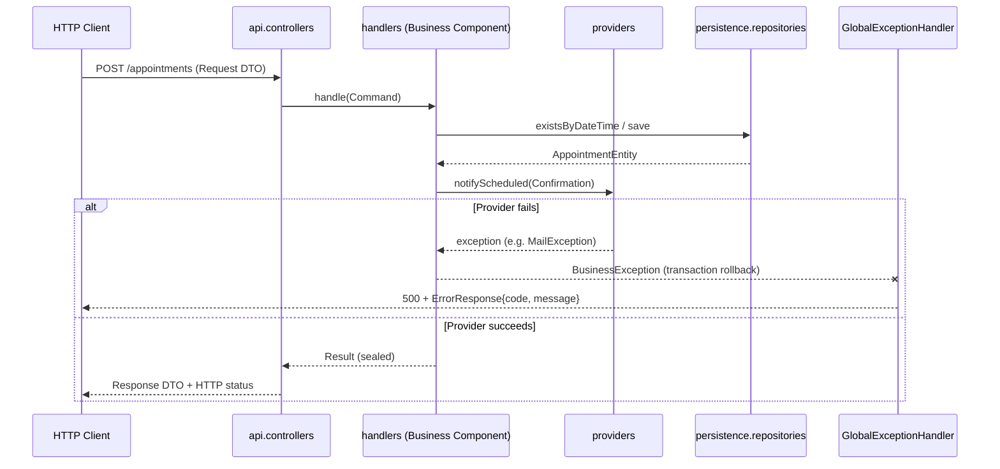

> **Reference architecture for this repository.** Translated from `spring-boot-ai-tutorial/ARQUITECTURA.md`.
> Compliance is mandatory per `.specify/memory/constitution.md` (principle I); repository-specific adaptations
> (security, session, ArchUnit rules) live in the constitution and in `CLAUDE.md`.

# Reference Architecture — Spring Boot + CQRS

> This document describes the architecture built in this project, intended to serve as a
> **reusable baseline for other Spring Boot projects**. It is not material from the video
> series — it is the technical reference distilled from what was built there.

The concrete example used throughout this document is the **appointment booking
(Appointments)** domain, but the structure and rules apply to any domain.

---

## 1. Design principles

1. **Strict separation between layers.** The REST layer (`api`) never knows the persistence
   model, and vice versa. A JPA entity is never exposed directly in an HTTP response, nor
   received directly from a request.
2. **Explicit CQRS.** Each use case (write or read) is a self-contained unit: a handler
   interface with its Command/Query and its Result, all nested in the same file.
3. **One business component = one implemented handler.** There is no separate `business`
   layer of generic service interfaces. The handler interface (defined alongside the
   Command/Query) plus its implementation **are** the Business Component. This satisfies ISP
   naturally: each interface declares exactly one method, for a single use case.
4. **Typed results over exceptions for normal flow.** Expected business outcomes (success,
   conflict, not found, etc.) are modeled with a `sealed interface` Result, consumed with an
   exhaustive `switch` — never with exceptions or `null`.
5. **Exceptions reserved for rollback.** Business exceptions are *unchecked* and are thrown
   only when an operation already in progress must be undone (transactional rollback) —
   they do not replace the Result flow.
6. **External integrations behind an interface (`Provider`).** Any dependency outside the
   system (email, SMS, payments, third-party services) is abstracted behind an interface of
   our own, which the Business Component depends on — never on the concrete implementation.
7. **UUID as identifier**, generated by the domain or the database, to avoid depending on
   auto-increments coordinated across environments.

---

## 2. Package structure

```
<root-package>
├── api                      → REST layer (HTTP input/output)
│   ├── controllers          → the @RestControllers
│   ├── request              → input DTOs
│   └── responses            → output DTOs (includes ErrorResponse)
├── handlers                 → application / CQRS layer
│   ├── commands              → Command Handler interfaces (+ nested Command and Result)
│   │                           and their implementations (= Business Components)
│   └── queries                → Query Handler interfaces (+ nested Query and Result)
│                                 and their implementations
├── providers                → use-case-agnostic external integrations
├── persistence              → data layer
│   ├── model                 → JPA entities
│   └── repositories           → Spring Data Repositories
└── exception                → business exception hierarchy (rollback)
```

No generic `business` or `service` package: the `handlers` fulfill that role.

---

## 3. The Handler pattern (nested Command/Query + Result)

Each use case is represented by **a single interface**. Nested inside it live both the
input parameter (`Command` or `Query`, a `record`) and the result (`Result`, a `sealed
interface`). The entire contract of that use case sits in a single file.

```java
public interface ScheduleAppointmentCommandHandler {

    Result handle(Command command);

    record Command(UUID patientId, LocalDateTime dateTime, String reason) {}

    sealed interface Result permits Result.Scheduled, Result.SlotUnavailable {
        record Scheduled(UUID id, UUID patientId, LocalDateTime dateTime, String reason)
                implements Result {}

        record SlotUnavailable(LocalDateTime dateTime)
                implements Result {}
    }
}
```

**Why nest everything together:** just by opening the file you see the full contract of the
use case — what goes in, what comes out, and every possible result. No jumping between
files to understand it.

**Why `sealed`:** the compiler knows all possible subtypes of `Result` in advance. A
`switch` over a `sealed` type needs no `default`, and if a new subtype is added without
handling it in some existing `switch`, the project **does not compile**. Exhaustiveness is
guaranteed by the compiler, not by team discipline.

The implementation of this interface (e.g. `ScheduleAppointmentCommandHandlerImpl`) is the
Business Component: a Spring `@Component`, injected wherever it is needed.

```java
@Component
public class ScheduleAppointmentCommandHandlerImpl implements ScheduleAppointmentCommandHandler {

    private final AppointmentJpaRepository repository;
    private final NotificationProvider notificationProvider;

    public ScheduleAppointmentCommandHandlerImpl(
            AppointmentJpaRepository repository, NotificationProvider notificationProvider) {
        this.repository = repository;
        this.notificationProvider = notificationProvider;
    }

    @Override
    @Transactional
    public Result handle(Command command) {
        if (repository.existsByDateTime(command.dateTime())) {
            return new Result.SlotUnavailable(command.dateTime());
        }

        var saved = repository.save(
                new AppointmentEntity(command.patientId(), command.dateTime(), command.reason()));

        notificationProvider.notifyScheduled(new NotificationProvider.Confirmation(
                saved.getId(), saved.getPatientId(), saved.getDateTime()));

        return new Result.Scheduled(
                saved.getId(), saved.getPatientId(), saved.getDateTime(), saved.getReason());
    }
}
```

Note the explicit mapping from `AppointmentEntity` (persistence) to `Result.Scheduled`
(handlers-layer domain): the entity never leaves this method.

---

## 4. `api` layer

- **`request`** and **`responses`**: DTOs (`record`) exclusive to the REST layer, never
  shared with `handlers` or `persistence`. Validated with Bean Validation (`@NotNull`,
  `@Future`, etc.), enabled in the controller with `@Valid`.
- **`controllers`**: receive the HTTP request, build the `Command`/`Query`, invoke the
  corresponding handler (injected by its interface, never by the implementation), and
  translate the `Result` into an HTTP response with a `switch`.

```java
@PostMapping
public ResponseEntity<?> schedule(@Valid @RequestBody CreateAppointmentRequest request) {
    var command = new ScheduleAppointmentCommandHandler.Command(
            request.patientId(), request.dateTime(), request.reason());

    return switch (scheduleHandler.handle(command)) {
        case ScheduleAppointmentCommandHandler.Result.Scheduled s ->
            ResponseEntity.created(URI.create("/appointments/" + s.id()))
                    .body(new AppointmentResponse(s.id(), s.patientId(), s.dateTime(), s.reason()));
        case ScheduleAppointmentCommandHandler.Result.SlotUnavailable u ->
            ResponseEntity.status(HttpStatus.CONFLICT).build();
    };
}
```

The controller contains no business logic — only translation between HTTP and the world of
handlers.

---

## 5. `providers` layer

An interface agnostic to the real implementation of an external integration. It lives at
the same level as `api`, `handlers` and `persistence` — not nested inside `handlers` —
because it is supporting infrastructure, not part of the use case itself.

```java
public interface NotificationProvider {
    void notifyScheduled(Confirmation confirmation);
    record Confirmation(UUID appointmentId, UUID patientId, LocalDateTime dateTime) {}
}
```

The Business Component depends only on `NotificationProvider`. Switching from email to SMS
means writing a new implementation — zero changes in `handlers`.

---

## 6. `persistence` layer

- **`model`**: JPA entities. UUID as `@Id` with `@GeneratedValue(strategy = GenerationType.UUID)`.
- **`repositories`**: interfaces that `extends JpaRepository<Entity, UUID>`. Spring Data
  generates the implementation at runtime — `@Repository` is not added manually, and no SQL
  is written for standard operations or for queries derived from the method name
  (`existsByDateTime(...)`, `findByX(...)`, etc.).

---

## 7. `exception` layer — business exceptions and rollback

**Core rule:** these exceptions do not replace the `Result` flow. They are thrown **only**
when an operation already in progress needs to be reverted (transactional rollback) due to
a real failure, not because of an expected business outcome.

```java
public enum ErrorCode {
    NOTIFICATION_FAILED(1001, "Could not send the notification for appointment {0}");

    private final int code;
    private final String messageTemplate;

    ErrorCode(int code, String messageTemplate) {
        this.code = code;
        this.messageTemplate = messageTemplate;
    }

    public int getCode() { return code; }
    public String getMessageTemplate() { return messageTemplate; }
}
```

```java
public class BusinessException extends RuntimeException {

    private final ErrorCode errorCode;
    private final List<Object> params;

    public BusinessException(ErrorCode errorCode, Object... params) {
        super(format(errorCode.getMessageTemplate(), Arrays.asList(params)));
        this.errorCode = errorCode;
        this.params = Arrays.asList(params);
    }

    private BusinessException(Builder builder) {
        this(builder.errorCode, builder.params.toArray());
    }

    public ErrorCode getErrorCode() { return errorCode; }
    public List<Object> getParams() { return params; }

    private static String format(String template, List<Object> params) {
        String message = template;
        for (int i = 0; i < params.size(); i++) {
            message = message.replace("{" + i + "}", String.valueOf(params.get(i)));
        }
        return message;
    }

    public static Builder builder(ErrorCode errorCode) { return new Builder(errorCode); }

    public static final class Builder {
        private final ErrorCode errorCode;
        private final List<Object> params = new ArrayList<>();

        private Builder(ErrorCode errorCode) { this.errorCode = errorCode; }

        public Builder param(Object value) { params.add(value); return this; }

        public BusinessException build() { return new BusinessException(this); }
    }
}
```

- **`RuntimeException` (unchecked):** does not clutter method signatures with `throws`, and
  lets `@Transactional` roll back automatically without an explicit `rollbackFor` (by
  default Spring only rolls back automatically on unchecked exceptions).
- **A single base type**, with concrete subtypes **only when they add value** (not one
  subclass per `ErrorCode`).
- **Constructor and Builder**, both available: the constructor for the simple case, the
  Builder (chainable `.param(...)`) to avoid building arrays by hand when throwing.

**Centralized handling**, in `api`:

```java
@RestControllerAdvice
public class GlobalExceptionHandler {

    @ExceptionHandler(BusinessException.class)
    public ResponseEntity<ErrorResponse> handleBusinessException(BusinessException ex) {
        return ResponseEntity.status(HttpStatus.INTERNAL_SERVER_ERROR)
                .body(new ErrorResponse(ex.getErrorCode().getCode(), ex.getMessage()));
    }
}
```

`@ExceptionHandler(BusinessException.class)` catches the base type and, through
inheritance, any subtype — there is no need for one `@ExceptionHandler` per concrete
exception.

---

## 8. Full request flow



---

## 9. Checklist for applying this architecture to a new project

- [ ] Four top-level packages: `api`, `handlers`, `providers`, `persistence` (+ `exception`).
- [ ] One handler per use case, with Command/Query and a `sealed` Result nested in the same interface.
- [ ] The handler implementation is the Business Component — no separate `business` layer.
- [ ] Controllers without business logic: they only build the Command/Query and translate the Result to HTTP.
- [ ] No JPA entity leaves `persistence` or `handlers` — always explicit mapping to DTO/Result.
- [ ] Every external integration behind a `Provider` interface of our own.
- [ ] Business exceptions: unchecked, a hierarchy over a base with `ErrorCode` + Builder, used only to force rollback.
- [ ] A single `@RestControllerAdvice` catching the base exception.
- [ ] UUID as the identifier in entities.

---
