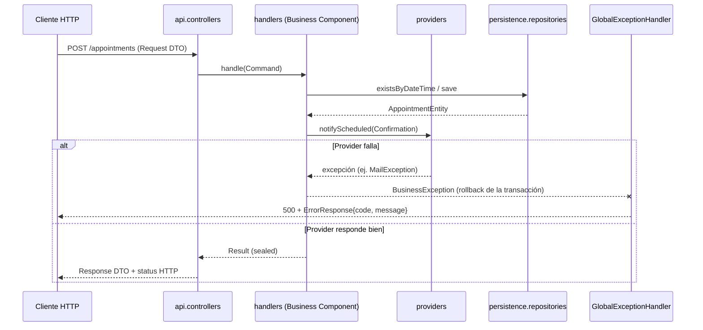

> **Arquitectura de referencia de este repositorio.** Copiada de `spring-boot-ai-tutorial/ARQUITECTURA.md`.
> Es de cumplimiento obligatorio según `.specify/memory/constitution.md` (principio I); las adaptaciones
> específicas de este repo (seguridad, sesión, reglas ArchUnit) están en la constitución y en `CLAUDE.md`.

# Arquitectura de Referencia — Spring Boot + CQRS

> Este documento describe la arquitectura construida en este proyecto, con el objetivo de
> servir como **base reutilizable para otros proyectos** con Spring Boot. No es material de
> la serie de videos — es la referencia técnica destilada de lo que se construyó ahí.

El ejemplo concreto usado a lo largo de este documento es el dominio de **reservas de citas
(Appointments)**, pero la estructura y las reglas aplican a cualquier dominio.

---

## 1. Principios de diseño

1. **Separación estricta entre capas.** La capa REST (`api`) nunca conoce el modelo de
   persistencia, y viceversa. Nunca se expone una entidad JPA directamente en una respuesta
   HTTP ni se recibe una entidad directamente desde una petición.
2. **CQRS explícito.** Cada caso de uso (escritura o lectura) es una unidad autocontenida:
   una interfaz de handler con su Command/Query y su Result, todo anidado en un mismo
   archivo.
3. **Un componente de negocio = un handler implementado.** No existe una capa `business`
   separada de interfaces genéricas de servicio. La interfaz del handler (definida junto al
   Command/Query) más su implementación **son** el Business Component. Esto cumple ISP de
   forma natural: cada interfaz declara exactamente un método, para un solo caso de uso.
4. **Resultados tipados sobre excepciones para el flujo normal.** Los desenlaces de negocio
   esperados (éxito, conflicto, no encontrado, etc.) se modelan con `sealed interface`
   Result, consumido con `switch` exhaustivo — nunca con excepciones ni con `null`.
5. **Excepciones reservadas para rollback.** Las excepciones de negocio son *no chequeadas*
   y se lanzan únicamente cuando hace falta deshacer una operación ya iniciada (rollback
   transaccional) — no reemplazan el flujo de Result.
6. **Integraciones externas tras una interfaz (`Provider`).** Cualquier dependencia hacia
   afuera del sistema (correo, SMS, pagos, servicios de terceros) se abstrae detrás de una
   interfaz propia, de la que el Business Component depende — nunca de la implementación
   concreta.
7. **UUID como identificador**, generado desde el dominio o la base de datos, para no
   depender de autoincrementales coordinados entre entornos.

---

## 2. Estructura de paquetes

```
<paquete-raíz>
├── api                      → capa REST (entrada/salida HTTP)
│   ├── controllers          → los @RestController
│   ├── request              → DTOs de entrada
│   └── responses            → DTOs de salida (incluye ErrorResponse)
├── handlers                 → capa de aplicación / CQRS
│   ├── commands              → interfaces de Command Handler (+ Command y Result anidados)
│   │                           y sus implementaciones (= Business Components)
│   └── queries                → interfaces de Query Handler (+ Query y Result anidados)
│                                 y sus implementaciones
├── providers                → integraciones externas agnósticas al caso de uso
├── persistence              → capa de datos
│   ├── model                 → entidades JPA
│   └── repositories           → Spring Data Repositories
└── exception                → jerarquía de excepciones de negocio (rollback)
```

Ningún paquete `business` ni `service` genérico: los `handlers` cumplen ese rol.

---

## 3. El patrón de Handler (Command/Query + Result anidados)

Cada caso de uso se representa con **una sola interfaz**. Dentro de ella, anidados, viven
tanto el parámetro de entrada (`Command` o `Query`, un `record`) como el resultado
(`Result`, una `sealed interface`). Todo el contrato de ese caso de uso queda en un único
archivo.

```java
public interface ScheduleAppointmentCommandHandler {

    Result handle(Command command);

    record Command(UUID patientId, LocalDateTime dateTime, String reason) {}

    sealed interface Result permits Result.Scheduled, Result.SlotUnavailable {
        record Scheduled(UUID id, UUID patientId, LocalDateTime dateTime, String reason)
                implements Result {}

        record SlotUnavailable(LocalDateTime dateTime)
                implements Result {}
    }
}
```

**Por qué anidar todo junto:** con solo abrir el archivo se ve el contrato completo del caso
de uso — qué entra, qué sale, y todos los resultados posibles. No hay que saltar entre
archivos para entenderlo.

**Por qué `sealed`:** el compilador conoce de antemano todos los subtipos posibles de
`Result`. Un `switch` sobre un `sealed` no necesita `default`, y si se agrega un subtipo
nuevo sin contemplarlo en algún `switch` existente, el proyecto **no compila**. Es
exhaustividad garantizada por el compilador, no por disciplina del equipo.

La implementación de esta interfaz (ej. `ScheduleAppointmentCommandHandlerImpl`) es el
Business Component: un `@Component` de Spring, inyectado donde haga falta.

```java
@Component
public class ScheduleAppointmentCommandHandlerImpl implements ScheduleAppointmentCommandHandler {

    private final AppointmentJpaRepository repository;
    private final NotificationProvider notificationProvider;

    public ScheduleAppointmentCommandHandlerImpl(
            AppointmentJpaRepository repository, NotificationProvider notificationProvider) {
        this.repository = repository;
        this.notificationProvider = notificationProvider;
    }

    @Override
    @Transactional
    public Result handle(Command command) {
        if (repository.existsByDateTime(command.dateTime())) {
            return new Result.SlotUnavailable(command.dateTime());
        }

        var saved = repository.save(
                new AppointmentEntity(command.patientId(), command.dateTime(), command.reason()));

        notificationProvider.notifyScheduled(new NotificationProvider.Confirmation(
                saved.getId(), saved.getPatientId(), saved.getDateTime()));

        return new Result.Scheduled(
                saved.getId(), saved.getPatientId(), saved.getDateTime(), saved.getReason());
    }
}
```

Nótese el mapeo explícito de `AppointmentEntity` (persistencia) a `Result.Scheduled`
(dominio de la capa handlers): la entidad nunca sale de este método.

---

## 4. Capa `api`

- **`request`** y **`responses`**: DTOs (`record`) exclusivos de la capa REST, nunca
  compartidos con `handlers` ni `persistence`. Validación con Bean Validation
  (`@NotNull`, `@Future`, etc.) activada en el controller con `@Valid`.
- **`controllers`**: reciben la petición HTTP, arman el `Command`/`Query`, invocan el
  handler correspondiente (inyectado por su interfaz, nunca por la implementación), y
  traducen el `Result` a una respuesta HTTP con un `switch`.

```java
@PostMapping
public ResponseEntity<?> schedule(@Valid @RequestBody CreateAppointmentRequest request) {
    var command = new ScheduleAppointmentCommandHandler.Command(
            request.patientId(), request.dateTime(), request.reason());

    return switch (scheduleHandler.handle(command)) {
        case ScheduleAppointmentCommandHandler.Result.Scheduled s ->
            ResponseEntity.created(URI.create("/appointments/" + s.id()))
                    .body(new AppointmentResponse(s.id(), s.patientId(), s.dateTime(), s.reason()));
        case ScheduleAppointmentCommandHandler.Result.SlotUnavailable u ->
            ResponseEntity.status(HttpStatus.CONFLICT).build();
    };
}
```

El controller no contiene lógica de negocio — solo traducción entre HTTP y el mundo de
handlers.

---

## 5. Capa `providers`

Interfaz agnóstica a la implementación real de una integración externa. Vive al mismo nivel
que `api`, `handlers` y `persistence` — no anidada dentro de `handlers` — porque es
infraestructura de soporte, no parte del caso de uso en sí.

```java
public interface NotificationProvider {
    void notifyScheduled(Confirmation confirmation);
    record Confirmation(UUID appointmentId, UUID patientId, LocalDateTime dateTime) {}
}
```

El Business Component depende únicamente de `NotificationProvider`. Cambiar de correo a SMS
implica escribir una nueva implementación — cero cambios en `handlers`.

---

## 6. Capa `persistence`

- **`model`**: entidades JPA. UUID como `@Id` con `@GeneratedValue(strategy = GenerationType.UUID)`.
- **`repositories`**: interfaces `extends JpaRepository<Entity, UUID>`. Spring Data genera
  la implementación en tiempo de ejecución — no se anota `@Repository` manualmente, ni se
  escribe SQL para las operaciones estándar o para queries derivadas del nombre del método
  (`existsByDateTime(...)`, `findByX(...)`, etc.).

---

## 7. Capa `exception` — excepciones de negocio y rollback

**Regla central:** estas excepciones no reemplazan el flujo de `Result`. Se lanzan
**solo** cuando una operación ya en curso necesita revertirse (rollback transaccional) por
un fallo real, no por un desenlace de negocio esperado.

```java
public enum ErrorCode {
    NOTIFICATION_FAILED(1001, "No se pudo enviar la notificación para la cita {0}");

    private final int code;
    private final String messageTemplate;

    ErrorCode(int code, String messageTemplate) {
        this.code = code;
        this.messageTemplate = messageTemplate;
    }

    public int getCode() { return code; }
    public String getMessageTemplate() { return messageTemplate; }
}
```

```java
public class BusinessException extends RuntimeException {

    private final ErrorCode errorCode;
    private final List<Object> params;

    public BusinessException(ErrorCode errorCode, Object... params) {
        super(format(errorCode.getMessageTemplate(), Arrays.asList(params)));
        this.errorCode = errorCode;
        this.params = Arrays.asList(params);
    }

    private BusinessException(Builder builder) {
        this(builder.errorCode, builder.params.toArray());
    }

    public ErrorCode getErrorCode() { return errorCode; }
    public List<Object> getParams() { return params; }

    private static String format(String template, List<Object> params) {
        String message = template;
        for (int i = 0; i < params.size(); i++) {
            message = message.replace("{" + i + "}", String.valueOf(params.get(i)));
        }
        return message;
    }

    public static Builder builder(ErrorCode errorCode) { return new Builder(errorCode); }

    public static final class Builder {
        private final ErrorCode errorCode;
        private final List<Object> params = new ArrayList<>();

        private Builder(ErrorCode errorCode) { this.errorCode = errorCode; }

        public Builder param(Object value) { params.add(value); return this; }

        public BusinessException build() { return new BusinessException(this); }
    }
}
```

- **`RuntimeException` (no chequeada):** no ensucia firmas de método con `throws`, y permite
  que `@Transactional` haga rollback automático sin `rollbackFor` explícito (Spring solo
  hace rollback automático de unchecked por defecto).
- **Un solo tipo base**, subtipos concretos **solo cuando aportan valor** (no una subclase
  por cada `ErrorCode`).
- **Constructor y Builder**, ambos disponibles: el constructor para el caso simple, el
  Builder (`.param(...)` encadenable) para no tener que construir arreglos a mano al lanzar.

**Manejo centralizado**, en `api`:

```java
@RestControllerAdvice
public class GlobalExceptionHandler {

    @ExceptionHandler(BusinessException.class)
    public ResponseEntity<ErrorResponse> handleBusinessException(BusinessException ex) {
        return ResponseEntity.status(HttpStatus.INTERNAL_SERVER_ERROR)
                .body(new ErrorResponse(ex.getErrorCode().getCode(), ex.getMessage()));
    }
}
```

`@ExceptionHandler(BusinessException.class)` captura la base y, por herencia, cualquier
subtipo — no hace falta un `@ExceptionHandler` por cada excepción concreta.

---

## 8. Flujo completo de una petición



---

## 9. Checklist para aplicar esta arquitectura en un proyecto nuevo

- [ ] Cuatro paquetes de primer nivel: `api`, `handlers`, `providers`, `persistence` (+ `exception`).
- [ ] Un handler por caso de uso, con Command/Query y Result `sealed` anidados en la misma interfaz.
- [ ] La implementación del handler es el Business Component — sin capa `business` aparte.
- [ ] Controllers sin lógica de negocio: solo arman Command/Query y traducen Result a HTTP.
- [ ] Ninguna entidad JPA sale de `persistence` ni de `handlers` — siempre mapeo explícito a DTO/Result.
- [ ] Toda integración externa detrás de una interfaz `Provider` propia.
- [ ] Excepciones de negocio: no chequeadas, jerarquía sobre una base con `ErrorCode` + Builder, usadas solo para forzar rollback.
- [ ] Un único `@RestControllerAdvice` capturando la excepción base.
- [ ] UUID como identificador en las entidades.
